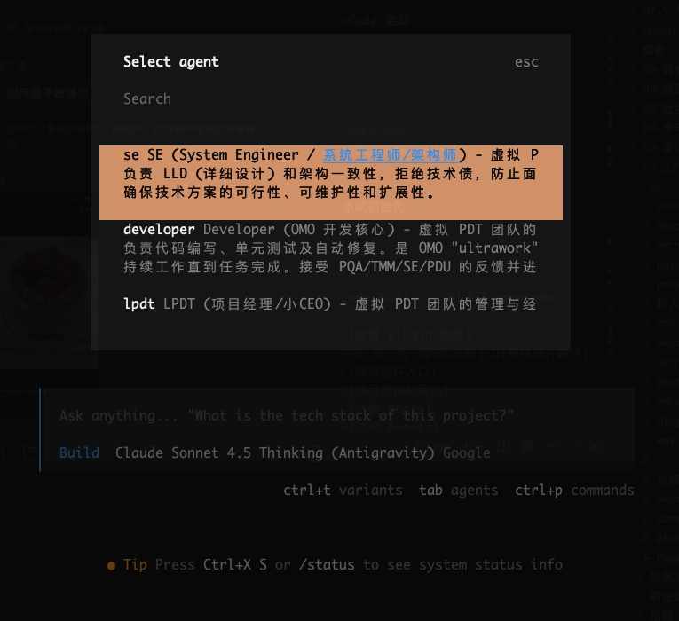
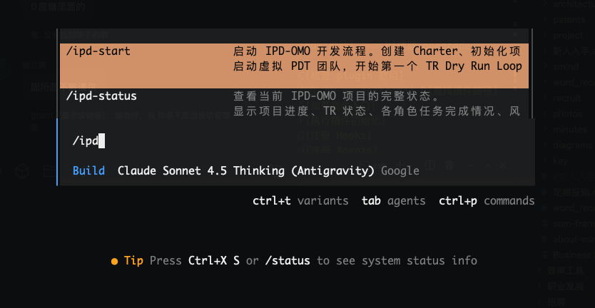
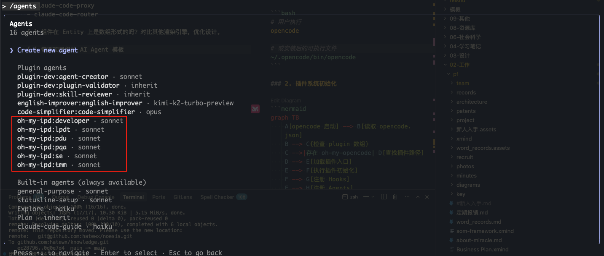
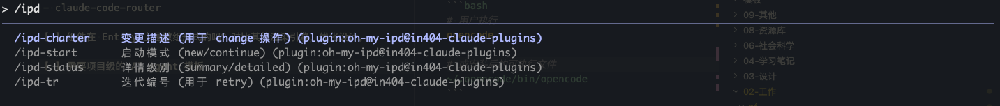

# Installation Guide

[中文文档](./INSTALLATION.md)

This plugin supports two AI coding assistant platforms: **OpenCode** and **Claude Code**.

## Option 1: OpenCode (Recommended)

OpenCode natively supports Markdown configuration, making installation very simple.

### 1. Clone Repository

```bash
git clone https://github.com/hatewx/oh-my-ipd
cd oh-my-ipd
```

### 2. Run Installation Script

```bash
./setup-opencode.sh
```

### 3. Verify Installation

```bash
./verify-installation.sh

opencode
```

In OpenCode:

- Type `/agents` to see 6 PDT team members

  

- Type `/ipd` to see 4 IPD commands

  

### Use with oh-my-opencode

Recommended to use with [oh-my-opencode](https://github.com/code-yeongyu/oh-my-opencode) for enhanced development workflows like `/ulw-loop` and `/ralph-loop`.

---

## Option 2: Claude Code

### 1. Clone to Plugin Directory

```bash
# Clone directly to Claude Code plugin directory
git clone https://github.com:hatewx/oh-my-ipd \
  ~/.claude/plugins/oh-my-ipd
```

Or use symbolic link:

```bash
# Create symbolic link
ln -s ~/path/to/oh-my-ipd ~/.claude/plugins/oh-my-ipd
```

### 2. Restart Claude Code

Restart Claude Code to load the plugin.

### 3. Verify Installation

In Claude Code:

- Type `/agents` to see 6 PDT team members

  

- Type `/ipd` to see 4 IPD commands

  

---

## Installation Locations

### OpenCode

All files installed in `~/.config/opencode/`:

```bash
~/.config/opencode/
├── agents/
│   ├── developer.md
│   ├── lpdt.md
│   ├── pdu.md
│   ├── pqa.md
│   ├── se.md
│   └── tmm.md
├── commands/
│   ├── ipd-charter.md
│   ├── ipd-start.md
│   ├── ipd-status.md
│   └── ipd-tr.md
├── skills/
│   ├── ipd-workflow/SKILL.md
│   └── pdt-collaboration/SKILL.md
└── plugins/
    └── oh-my-ipd-hooks.js
```

### Claude Code

Plugin installed in `~/.claude/plugins/oh-my-ipd/`.

---

## Next Steps

After installation, check the [Quick Start Guide](./README.en.md#quick-start) to get started.
